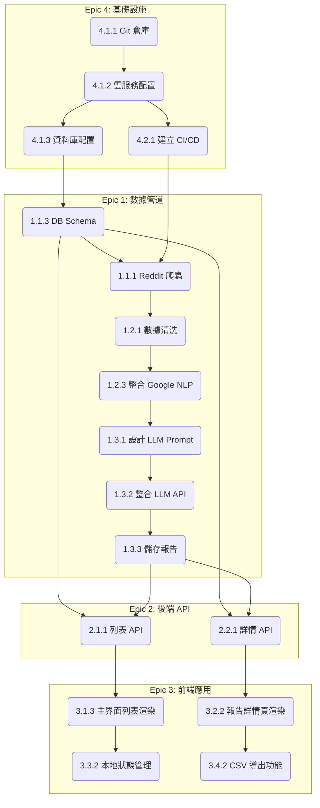

這是一份為「痛點雷達 (Pain Point Radar) MVP V1.0」專案量身打造的詳細開發計劃。

## 1\. 任務拆解 (Work Breakdown Structure - WBS)

我們將專案拆分為四個主要的功能模組 (Epics)。

### **Epic 1: 數據管道與 AI 分析核心 (Data Pipeline & AI Analysis Core)**

這是專案的「大腦」，負責從原始數據中提取、分析並生成有價值的商業機會。

  * **用戶故事 1.1:** 作為系統，我需要定期從指定的 Reddit 子版塊 (Subreddit) 中獲取新的帖子和評論，以便進行後續分析。

      * **子任務 1.1.1:** 開發 Reddit API 爬蟲腳本，用於抓取目標 Subreddit（如 `r/travel`）的數據。 `#後端`
      * **子任務 1.1.2:** 設定排程任務（如 Cron Job 或 Cloud Scheduler），實現每日自動化抓取。 `#DevOps`
      * **子任務 1.1.3:** 設計資料庫 Schema，用於儲存原始帖子和評論數據。 `#資料庫` `#後端`

  * **用戶故事 1.2:** 作為系統，我需要對抓取到的文本數據進行預處理和分析，以識別潛在的痛點和市場信號。

      * **子任務 1.2.1:** 建立文本數據清洗與過濾的流程，去除噪聲。 `#後端`
      * **子任務 1.2.2:** 設計並實現一個基於關鍵詞的「提及計數」分析器。 `#後端`
      * **子任務 1.2.3:** 整合 Google Cloud Natural Language AI API，對文本進行情緒分析和實體識別（用於生成用戶畫像標籤）。 `#後端`
      * **子任務 1.2.4:** 將分析後的結構化數據（情緒、提及數、用戶標籤等）存入資料庫。 `#資料庫` `#後端`

  * **用戶故事 1.3:** 作為系統，我需要利用大型語言模型 (LLM) 將識別出的痛點，自動生成一份結構化的「機會分析報告」。

      * **子任務 1.3.1:** 設計一套用於生成報告的 LLM Prompt Chain（或 Agentic Workflow）。這可能包含多個步驟：
        1.  **第一步 Prompt:** 總結痛點並從原始數據中摘錄典型抱怨。
        2.  **第二步 Prompt:** 根據痛點提出 "小而美" 的產品形態建議。
        3.  **第三步 Prompt:** 分析潛在競品並提出冷啟動策略。
            `#後端` `#AI/ML`
      * **子任務 1.3.2:** 開發與 LLM API（如 Gemini API）的整合服務，並處理 API 的輸入與輸出。 `#後端`
      * **子任務 1.3.3:** 設計並實現將最終生成的報告 JSON 存儲到應用程式主資料庫的邏輯。 `#資料庫` `#後端`

### **Epic 2: 後端 API 服務 (Backend API Service)**

這是連接數據核心與前端應用的橋樑。

  * **用戶故事 2.1:** 作為前端應用，我需要一個 API 來獲取已生成的「機會卡片」列表。

      * **子任務 2.1.1:** 建立 `GET /api/opportunities` 端點，支持分頁查詢。 `#後端`
      * **子任務 2.1.2:** 設計 API 的 JSON 響應格式，包含機會卡片所需的核心信息。 `#後端`

  * **用戶故事 2.2:** 作為前端應用，當用戶點擊某張卡片時，我需要一個 API 來獲取完整的「機會分析報告」詳情。

      * **子任務 2.2.1:** 建立 `GET /api/opportunities/:id` 端點，根據 ID 獲取單一報告的詳細數據。 `#後端` `#資料庫`

### **Epic 3: 前端應用 (Frontend Application)**

用戶直接互動的 Web 界面。

  * **用戶故事 3.1:** 作為 Alex，我希望能看到一個持續更新的、類似收件箱的「痛點機會流」列表。

      * **子任務 3.1.1:** 搭建前端專案框架（如 React/Next.js, Vue/Nuxt.js）。 `#前端`
      * **子任務 3.1.2:** 開發可重用的「機會卡片」(Opportunity Card) 組件。 `#前端`
      * **子任務 3.1.3:** 實現主界面的單欄垂直列表佈局，並調用 API 渲染卡片列表。 `#前端`
      * **子任務 3.1.4:** 實現無限滾動或分頁加載功能，提升瀏覽體驗。 `#前端`

  * **用戶故事 3.2:** 作為 Alex，我希望點擊任一痛點後，能看到一份詳細的分析報告。

      * **子任務 3.2.1:** 創建「機會分析報告」的詳情頁面路由與佈局。 `#前端`
      * **子任務 3.2.2:** 開發各個報告模塊的顯示組件（痛點詳情、市場信號圖表、商業建議等）。 `#前端`
      * **子任務 3.2.3:** 整合一個輕量級的圖表庫（如 Chart.js 或 D3）來顯示提及趨勢圖。 `#前端`

  * **用戶故事 3.3:** 作為 Alex，我希望能在本地標記和管理我感興趣的機會。

      * **子任務 3.3.1:** 實現基於 `localStorage` 的狀態管理邏輯，用於存儲已讀/未讀和歸檔狀態。 `#前端`
      * **子任務 3.3.2:** 在「機會卡片」上開發交互按鈕（標為已讀、歸檔），並更新本地狀態與 UI。 `#前端`
      * **子任務 3.3.3:** 實現簡易的篩選功能，允許用戶查看「未讀」或「已歸檔」的機會。 `#前端`

  * **用戶故事 3.4:** 作為 Alex，我希望能將報告導出為 CSV 文件以便離線分析。

      * **子任務 3.4.1:** 開發一個客戶端 JSON-to-CSV 的轉換工具函數。 `#前端`
      * **子任務 3.4.2:** 在報告詳情頁面放置「導出為 CSV」按鈕並綁定下載功能。 `#前端`

### **Epic 4: 基礎設施與部署 (Infrastructure & DevOps)**

確保專案能夠順利開發、測試和上線。

  * **用戶故事 4.1:** 作為開發團隊，我們需要標準化的開發、測試和生產環境。

      * **子任務 4.1.1:** 初始化 Git 倉庫並設定分支策略（如 GitFlow）。 `#DevOps`
      * **子任務 4.1.2:** 選擇並配置雲服務提供商（如 Google Cloud, Vercel, AWS）。 `#DevOps`
      * **子任務 4.1.3:** 創建並配置開發、測試、生產環境的資料庫實例。 `#DevOps` `#資料庫`

  * **用戶故事 4.2:** 作為開發團隊，我們希望能自動化構建、測試和部署流程。

      * **子任務 4.2.1:** 建立 CI/CD Pipeline（如使用 GitHub Actions）。 `#DevOps`
      * **子任務 4.2.2:** 編寫後端服務的容器化文件（Dockerfile）。 `#後端` `#DevOps`
      * **子任務 4.2.3:** 配置 Pipeline，實現 push 到 develop 分支自動部署到 Staging，push 到 main 分支自動部署到 Production。 `#DevOps`

## 2\. 任務依賴關係 (Task Dependencies)

  * **關鍵路徑 (Critical Path):** 專案的總時程主要由數據管道的開發決定。
    `基礎設施配置 (A2, A3)` -\> `資料庫 Schema 設計 (C1)` -\> `Reddit 爬蟲 (C2)` -\> `整合 NLP & LLM (C4, C6)` -\> `儲存最終報告 (C7)` -\> `後端 API 開發 (D1, D2)` -\> `前端頁面渲染 (E1, E2)`

## 3\. 系統上線部署計畫 (Deployment Plan)

  * **環境規劃:**

      * **開發 (Development):** 工程師在本地機器上進行開發，連接本地或共享的開發資料庫。
      * **測試 (Staging):** 從 `develop` 分支自動部署。此環境 максимально 模擬生產環境，用於內部測試和 UAT。連接獨立的 Staging 資料庫。
      * **正式 (Production):** 從 `main` 分支部署，通常在 Staging 環境驗證通過後手動觸發或合併 PR 觸發。這是面向最終用戶的穩定環境。

  * **部署流程 (CI/CD):**

    1.  **觸發:** 開發者將代碼推送到 GitHub 上的 `develop` 或 `main` 分支。
    2.  **構建:** GitHub Actions 啟動，安裝依賴，運行單元測試和整合測試。
    3.  **打包:**
          * **後端:** 構建 Docker 鏡像並推送到容器倉庫（如 Google Artifact Registry）。
          * **前端:** 構建靜態文件。
    4.  **部署:**
          * **Staging:** 自動將新的 Docker 鏡像部署到雲服務（如 Cloud Run），並將前端文件部署到託管服務（如 Vercel, Netlify）。
          * **Production:** 在 Staging 測試通過後，合併 `develop` 到 `main` 分支，觸發對生產環境的部署。建議增加一個手動審批環節。

  * **上線檢查清單:**

      * [ ] 所有環境變量（API Keys, 資料庫連接字符串）已在生產環境中正確配置。
      * [ ] 資料庫已完成初始化遷移。
      * [ ] 後端 API 的日誌記錄 (Logging) 和監控 (Monitoring) 已配置。
      * [ ] 網站的域名 (DNS) 和 SSL 證書已配置正確。
      * [ ] 已對 Staging 環境完成最後一輪端到端測試。
      * [ ] 已通知所有利害關係人上線時間窗口。

## 4\. 系統測試計劃 (Testing Plan)

  * **測試策略:**

      * **單元測試 (Unit Tests):** 開發者為關鍵的、獨立的函數編寫測試（例如：CSV 轉換器、數據清洗函數）。由 CI 流程自動執行。
      * **整合測試 (Integration Tests):** 測試模塊間的交互，重點測試 API 端點能否正確地與資料庫和外部服務（Google NLP, LLM）協作。
      * **端到端測試 (E2E Tests):** 使用自動化框架（如 Cypress）模擬完整的用戶場景（從打開網頁到導出 CSV）。在部署到 Staging 環境後自動運行。
      * **用戶驗收測試 (UAT):** 產品經理 (PM) 和核心利益相關者在 Staging 環境中，根據 PRD 的功能描述進行手動測試，確認產品符合預期。

  * **核心功能測試案例 (標題):**

    1.  [TC-01] 驗證「機會流」頁面能成功加載並顯示機會卡片。
    2.  [TC-02] 驗證點擊卡片後能正確跳轉到對應的「機會分析報告」頁面。
    3.  [TC-03] 驗證報告頁面中的所有數據模塊（詳情、圖表、建議）都已正確顯示。
    4.  [TC-04] 驗證「導出為 CSV」功能可以下載包含正確數據的 CSV 文件。
    5.  [TC-05] 驗證「標為已讀」功能在刷新頁面後狀態依然保留。
    6.  [TC-06] 驗證「歸檔」功能可以將卡片從主列表中移除。
    7.  [TC-07] 驗證頁面在主流桌面瀏覽器（Chrome, Safari, Firefox）上佈局正常。
    8.  [TC-08] 驗證數據管道能夠每日成功執行並生成新的機會報告。

## 5\. UI/UX 介面規劃 (UI/UX Planning)

  * **頁面/畫面列表:**

    1.  **主界面 / 機會流 (Pain Point Feed):** 核心頁面，以收件箱風格展示機會卡片列表。
    2.  **機會分析報告頁 (Opportunity Analysis Report):** 詳情頁，展示單一機會的完整分析內容。

  * **使用者流程 (User Flow):**
    `進入網站` -\> `[主界面]` -\> `滾動瀏覽機會卡片列表` -\> `發現感興趣的卡片` -\> `(可選) 點擊歸檔按鈕忽略不感興趣的卡片` -\> `點擊卡片標題` -\> `[機會分析報告頁]` -\> `閱讀詳細分析` -\> `查看提及趨勢圖` -\> `點擊“導出為 CSV”按鈕` -\> `(文件下載)` -\> `點擊瀏覽器返回` -\> `回到[主界面]`

  * **關鍵元件 (Key Components):**

      * **通用 (General):**
          * 頁面頂部導航欄 (Header)
          * 頁腳 (Footer)
      * **主界面 (Pain Point Feed):**
          * **機會卡片 (Opportunity Card):** 包含產品標籤、痛點總結、數據標籤、已讀/未讀狀態指示器。
          * **簡易篩選器 (Filter Controls):** 用於切換“收件箱”、“已歸檔”視圖的按鈕或下拉菜單。
      * **機會分析報告頁 (Opportunity Analysis Report):**
          * **數據趨勢圖 (Trend Chart):** 顯示提及頻率的折線圖或柱狀圖。
          * **原始抱怨引用塊 (Quote Block):** 用於展示用戶原文抱怨。
          * **帶有Icon的列表 (Icon List):** 用於展示產品形態建議或推廣策略。
          * **主要的行動號召按鈕 (Primary CTA Button):** 「導出為 CSV」。